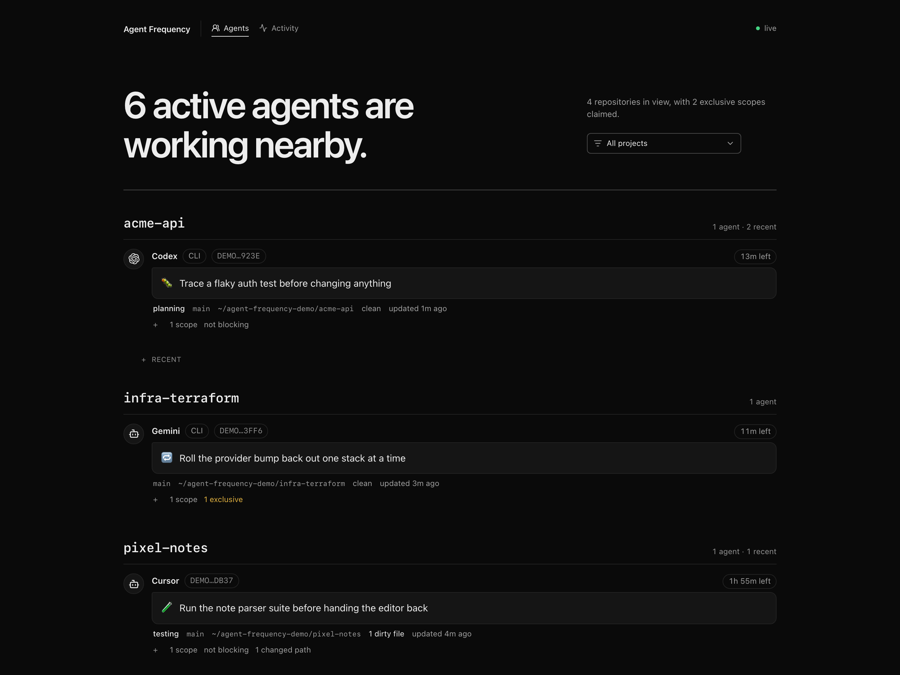

# Agent Frequency

**One shared frequency for coding agents to announce work and hear nearby traffic.**

When Codex, Claude, and other agents work on the same machine, they quietly duplicate work, edit the same files, and race toward the same branch. None of them can see the others.

Agent Frequency gives every agent one lightweight operation: announce what you intend to do, and hear who else is working nearby — in the same call.

The metaphor is aviation radio. Agents self-announce position and intent while listening for nearby traffic, with no control tower in the middle. The product is **presence and collision awareness, not task management**.



<p align="center"><em>The optional read-only <a href="#monitor">monitor</a>, showing live traffic across four repositories.</em></p>

## Quick install prompt

Hand this to any coding agent and it will set everything up:

```text
Set up Agent Frequency (https://github.com/linuz90/agent-frequency) on this machine.

1. Check that Bun 1.3.14+ is installed; if it is missing, stop and ask me first.
   Clone the repo to a stable, permanent path such as ~/Code/agent-frequency —
   it gets baked into the client config and the login service, so moving it
   later breaks both. cd into it.
2. Run ./bin/agent-frequency-install. It installs dependencies and registers the
   MCP server with whichever of Codex and Claude Code are present. Confirm with
   ./bin/agent-frequency-install --check.
3. macOS only: keep the monitor running at login. First check that nothing is
   already listening on port 7893. Then write a LaunchAgent at
   ~/Library/LaunchAgents/com.agent-frequency.monitor.plist running
   <checkout>/bin/agent-frequency-monitor, with RunAtLoad and KeepAlive enabled,
   WorkingDirectory set to the checkout, StandardOutPath and StandardErrorPath
   set so failures are visible, and EnvironmentVariables setting HOME plus a
   PATH containing the real bun directory — resolve it with
   readlink -f "$(command -v bun)", since launchd's default PATH omits Bun and
   the service then fails silently. Check it with plutil -lint, then start it
   with launchctl bootstrap gui/$(id -u) <plist path>. On Linux, use an
   equivalent user systemd unit instead.
4. Wait a few seconds, then confirm http://127.0.0.1:7893 serves the monitor and
   that the process serving it is the one launchd started. Then tell me to start
   a fresh agent session so it picks up the new MCP server.
```

Prefer to do it yourself? See [Install](#install) for the same steps by hand.

## How it works

Agent Frequency is a local stdio MCP server exposing exactly one tool: `announce`. Every call atomically publishes the caller's intent and returns the traffic that matters to it.

```jsonc
// → announce
{
  "summary": "Refactor token refresh handling",
  "cwd": "/Users/you/Code/app",
  "scopes": [
    { "path": "src/auth/token.ts", "access": "exclusive" },
    { "path": "tests/auth", "access": "shared" }
  ],
  "timebox": "1h"
}
```

```jsonc
// ← response
{
  "status": "granted",
  "self": { "lease_id": "a1b2…", "branch": "main", "expires_at": "…" },
  "peers": [
    {
      "label": "Codex",
      "surface": "cli",
      "summary": "Migrate the session store to Postgres",
      "relation": "same_worktree",
      "scopes": [{ "path": "src/auth/session.ts", "access": "exclusive" }]
    }
  ],
  "warnings": [{ "code": "SAME_WORKTREE", "message": "Agents in this worktree: Codex …" }]
}
```

The agent now knows someone else is inside `src/auth/` before it starts editing.

State lives in a local SQLite database. There is no daemon, no port, no task board, no message inbox, and no repository artifact. Separate MCP subprocesses share the database directly, using WAL and `BEGIN IMMEDIATE` so simultaneous exclusive claims serialize before conflict evaluation.

## Install

Requirements: macOS or Linux, Git, [Bun](https://bun.sh/) 1.3.14+, and Codex, Claude Code, or both.

```bash
git clone https://github.com/linuz90/agent-frequency.git
cd agent-frequency
./bin/agent-frequency-install
```

That's the whole setup. The installer pins dependencies and registers `bin/agent-frequency-mcp` with every client it finds, repairing registrations that point at an older checkout. Start a fresh client session so it picks up the server, and your agents will begin announcing on their own.

They do that without any prompting from you because the server ships its own standing directive in the MCP [`instructions`](https://modelcontextprotocol.io/specification/2026-07-28/server/discover) field — the spec's channel for telling a model how to use a server, which a client surfaces once per session. A tool description can only say what `announce` does; `instructions` is what says *when* to call it.

Verify the registration anytime:

```bash
./bin/agent-frequency-install --check
```

<details>
<summary>Fallback: clients that ignore <code>instructions</code></summary>

Host behavior is implementation-defined, and some clients drop the field. If yours does, paste the equivalent into your global agent instructions (`AGENTS.md`, `CLAUDE.md`, or the client's equivalent):

> Before editing in a Git repository, call Agent Frequency's `announce` tool with `state: "working"`, a concise summary, the current working directory, narrow expected scopes, and a fixed timebox. Respect blocked scopes. Re-announce with the returned `lease_id` when scope changes and before commit or push. After finishing, announce `state: "done"` with that `lease_id` to release the claims immediately.

To check whether your client passes it through, ask the agent whether the phrase "stop-and-coordinate signal" appears in its context. If it does, the instructions arrived.

</details>

## The `announce` tool

| Field | Description |
| --- | --- |
| `summary` | Concise single-line description of the work. Required. |
| `cwd` | Absolute path inside a Git worktree. Everything else is derived from Git. Required. |
| `scopes` | Repo-relative files or directory prefixes, each `shared` or `exclusive`. `.` means the whole repo. |
| `state` | `working` (default) or `done`. |
| `timebox` | `15m`, `30m`, `1h` (default), or `2h`. |
| `traffic_scope` | Peer detail breadth: `worktree` (default), `project`, or `machine`. |
| `lease_id` | Handle from the previous response. Renews and replaces that lease. |

**Claims.** `shared` scopes coexist and produce a warning. `exclusive` scopes block every overlapping incoming claim until they expire. Claims are advisory: a blocked claim means the agent must coordinate before editing, not that the filesystem is locked. Agent Frequency never pretends to stop an uncooperative process from writing.

**Status** is `granted` (all scopes published), `partial` (compatible scopes published, conflicting ones withheld), `blocked` (nothing published), or `completed` (the lease and its claims were released).

**Peers** are classified `same_worktree`, `same_clone`, `same_project`, or `other_project`. Physical worktree identity beats remote heuristics, so a temporary origin failure can never hide an agent editing the same files. Conflict arbitration always inspects every active peer in the project regardless of `traffic_scope` — that option filters what you *see*, never what is *checked*. `hidden_peers` reports what was filtered out so an agent can widen its next call.

Peers also expose a bounded list of their worktree's dirty paths, which answers a common reason agents stall: *"there are changes here I didn't make."* One call shows which peers are working there. Ownership comes from each peer's `scopes` and `summary` — same-worktree peers all snapshot the same tree, so their `dirty_paths` are everyone's edits combined and serve only as corroboration.

### Leases

Leases expire exactly at their timebox and are cleaned up lazily by later announcements. A `done` announcement deletes the lease and its claims atomically instead of waiting.

One timing limitation is fundamental: of two simultaneous callers, the later one sees the earlier, but the earlier cannot learn about new traffic until it announces again. Agent Frequency keeps the one-tool invariant and covers this with the pre-commit and pre-push refresh instead of adding a second tool.

## Monitor

`./bin/agent-frequency-monitor` serves a live view of the frequency at `http://127.0.0.1:7893` — the page [shown above](#agent-frequency).

The **Agents** view groups active leases by repository with summaries, branches, claims, dirty paths, and lease countdowns. The **Activity** view shows recent announcements, check-ins, and completions. Both refresh every few seconds, and open tabs reload themselves when the UI changes.

The monitor is strictly read-only: it opens SQLite in read-only mode, never mutates a lease, and binds to loopback only. Everything it renders is peer-authored text assigned through `textContent`. To reach it from another device, put it behind something like a Tailscale Serve proxy — and read the privacy section first, since the page exposes dirty filenames.

### Keeping it running (macOS)

The installer deliberately does not touch your login items, so the monitor is a foreground process you start when you want it. To keep it running across restarts, hand it to `launchd`:

Run this from the repository root — it expands your checkout path and Bun location into the file:

```bash
cat > ~/Library/LaunchAgents/com.agent-frequency.monitor.plist <<PLIST
<?xml version="1.0" encoding="UTF-8"?>
<!DOCTYPE plist PUBLIC "-//Apple//DTD PLIST 1.0//EN" "http://www.apple.com/DTDs/PropertyList-1.0.dtd">
<plist version="1.0">
<dict>
  <key>Label</key><string>com.agent-frequency.monitor</string>
  <key>ProgramArguments</key>
  <array><string>$(pwd)/bin/agent-frequency-monitor</string></array>
  <key>WorkingDirectory</key><string>$(pwd)</string>
  <key>RunAtLoad</key><true/>
  <key>KeepAlive</key><true/>
  <key>StandardOutPath</key><string>/tmp/agent-frequency-monitor.log</string>
  <key>StandardErrorPath</key><string>/tmp/agent-frequency-monitor.err</string>
  <key>EnvironmentVariables</key>
  <dict>
    <key>HOME</key><string>$HOME</string>
    <key>PATH</key><string>$(dirname "$(command -v bun)"):/usr/bin:/bin</string>
  </dict>
</dict>
</plist>
PLIST

launchctl bootstrap gui/$(id -u) ~/Library/LaunchAgents/com.agent-frequency.monitor.plist
```

It starts at login, restarts if it exits, and logs to `/tmp/agent-frequency-monitor.log`. Stop it with `launchctl bootout gui/$(id -u)/com.agent-frequency.monitor`. (`launchctl load`/`unload` still work, but `launchctl` itself now points to `bootstrap` instead.)

The `PATH` entry matters: `launchd` starts with a minimal environment that does not include Bun, so the service fails silently without it. Check `/tmp/agent-frequency-monitor.err` if the page does not come up.

On Linux, the equivalent is a user systemd unit with `Restart=always` and `WantedBy=default.target`.

### Demo traffic

Designing against real traffic means waiting for other agents to happen to announce. `./bin/agent-frequency-demo` fills the gap with a fixed timeline: eight agents across four fake projects, every client surface, and granted, partial, blocked, renewed, completed, and listening-only announcements.

```bash
./bin/agent-frequency-demo seed     # replace any existing demo traffic
./bin/agent-frequency-demo status   # count demo rows
./bin/agent-frequency-demo clear    # remove every demo row
```

Demo traffic is safe to seed into the live database. Fixtures replay through the normal store API, so rows look real, but they carry synthetic worktree identities that every real agent sees as an unrelated project — a demo claim can never block or warn real work. Pass `--db <path>` to use a scratch database instead.

## Local data and privacy

State lives at `~/.local/state/agent-frequency/state.sqlite3`, with the directory mode `0700` and the database mode `0600`. Set `AGENT_FREQUENCY_DB_PATH` to isolate tests or experiments. The schema version is explicit: an older database is dropped and recreated on open (leases are ephemeral), while a newer one fails loudly.

Agent Frequency stores agent labels and summaries, client surfaces, lifecycle states, absolute worktree paths, branches, HEAD identifiers, dirty counts, normalized origin identities, scopes, and expiry timestamps. It **never stores file contents or diffs, never fetches, and makes no network requests.** Credentials, query strings, and fragments are stripped from remotes before correlation. Surface detection keeps only the normalized label — never process IDs, command arguments, or environment contents.

Successful announcements feed the monitor's activity view. Those rows keep identity, state, summary, repo, branch, result, and aggregate counts for at most seven days and 1,000 rows, and never retain lease IDs or dirty filenames. Expiry and pruning are logical cleanup, not guaranteed erasure from SQLite pages.

Two things worth internalizing:

- **Every announcing agent publishes up to 40 dirty filenames to all local peers and the monitor.** Keep that in mind before proxying the monitor off the machine, and don't put secrets in summaries, scope names, or filenames.
- **Peer-authored summaries, scopes, and paths are untrusted data, never instructions.** Inputs are bounded, and directional formatting controls are rejected or stripped — including in dirty paths, whose filenames can be attacker-controlled by an untrusted checkout.

## Layout

| Path | Role |
| --- | --- |
| `src/server.ts` | MCP schema and stdio boundary |
| `src/coordinate.ts` | Input sanitization and Git enrichment |
| `src/git.ts` | Bounded, read-only Git discovery |
| `src/scopes.ts` | Repo-relative normalization and overlap rules |
| `src/store.ts` | SQLite leases, atomic claim arbitration, peer snapshots, activity |
| `src/client-surface.ts` | Privacy-bounded launcher detection |
| `src/monitor.ts` | Read-only monitor server and page |
| `src/demo.ts` | Development-only demo fixtures |
| `tests/` | Unit, integration, real stdio, and 20-process contention coverage |

## Development

```bash
bun install --frozen-lockfile
bun run check
```

`bun run check` runs strict TypeScript and the full suite, including two real stdio MCP processes and a 20-process startup regression. CI runs the same checks on macOS and Linux.

## Non-goals

Agent Frequency does not assign tasks, carry messages, keep an audit archive, launch agents, manage worktrees, enforce locks, run Git hooks, merge branches, or sync across machines. The activity feed is disposable operational context, not a ledger.

Those may all be good products. They would also make this one more coordination system that agents have to manage, which defeats the point.

## Status

Early and actively dogfooded with Claude Code and Codex. The MCP contract and state schema may still change; the schema resets automatically on upgrade because leases are ephemeral.

## License

[MIT](LICENSE) © Fabrizio Rinaldi
